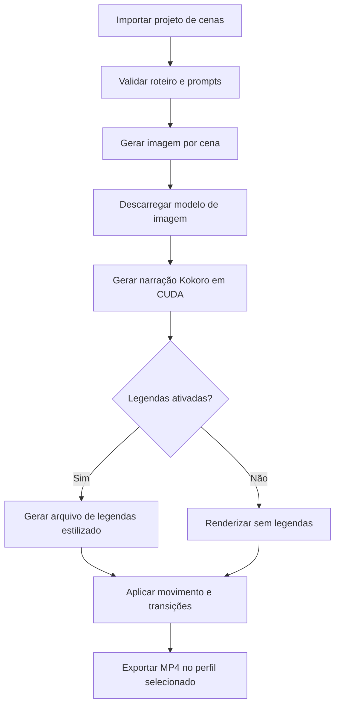

# Local Short Studio — arquitetura e fluxo do projeto

**Estado:** especificação criada antes da implementação; atualizada para documentar a entrega e as versões de runtime selecionadas.  
**Objetivo:** gerar vídeos localmente a partir de roteiro, imagens e narração, usando CUDA para inferência sempre que viável.  
**Primeira entrega:** Shorts verticais. A arquitetura deverá aceitar perfis de vídeo horizontal longo sem reescrever o fluxo.

## 1. Objetivo do produto

O projeto recebe cenas descritas pelo usuário, gera uma imagem para cada cena, produz a narração em português brasileiro, aplica movimentos de câmera simulados e transições suaves, e exporta um MP4 pronto para revisão/publicação.

O processo roda localmente no computador do usuário. Docker Compose organiza os serviços; Docker Desktop no Windows encaminha CUDA à GPU por WSL 2. Depois que código, dependências e pesos estiverem baixados, a geração não depende de inferência em nuvem.

## 2. Escopo e limites

### Incluído na primeira entrega

- Interface local simples para carregar ou editar roteiro e cenas.
- Geração local de imagens por ComfyUI usando Stable Diffusion 1.5 como perfil inicial para caber melhor em 6 GB de VRAM.
- Narração local pelo Kokoro-82M, com idioma `p` (português brasileiro) e seleção de voz compatível.
- Campo `visual_style` compartilhado entre cenas para manter paleta e aparência coerentes; roteiro e prompts podem ser preparados nesta conversa e importados como JSON.
- Execução CUDA sequencial, liberando os modelos de imagem antes de iniciar TTS para reduzir picos de VRAM.
- Movimento Ken Burns por cena: zoom lento, aproximação/afastamento e deslocamento lateral/vertical com easing suave.
- Transições configuráveis; predefinição de crossfade suave entre cenas.
- Legendas opcionais, desativadas por padrão. Quando ativadas: estilo moderno, fonte Inter ou alternativa sans-serif disponível, texto claro, fundo escuro translúcido e realce azul discreto.
- Exportação inicial vertical 9:16, H.264/AAC, 1080×1920 e 30 fps.
- Arquivos intermediários e finais salvos em volumes montados no host.
- Projeto de entrada exportável (JSON), roteiro/narração em TXT e MP4 final.
- Configuração por perfil para permitir futura saída horizontal 16:9 em 1920×1080, duração maior, sem alterar o modelo de cenas.

### Não incluído na primeira entrega

- Geração local de roteiro por um terceiro LLM. O roteiro e as descrições das cenas serão fornecidos pelo usuário ou preparados nesta conversa e importados.
- Animação generativa de pixels/personagens. O movimento desta versão será de câmera simulada sobre imagens estáticas.
- Publicação automática no YouTube ou integração com redes sociais.
- Música gerada. Música opcional poderá ser fornecida pelo usuário; o projeto não incluirá faixas sem licença.

## 3. Hardware e execução

### Máquina-alvo

- Windows 10/11 com Docker Desktop usando backend WSL 2.
- NVIDIA GeForce RTX 2060 com 6 GB VRAM.
- ComfyUI fixado em v0.38.0 com PyTorch 2.14/CUDA 13.0, compatível com GPUs NVIDIA Turing (RTX 2060) e driver Windows atualizado; app Kokoro usa runtime CUDA próprio.
- 16 GB de RAM. Fechar jogos e outras cargas de GPU/RAM durante a renderização é recomendado.

O suporte de GPU do Docker Desktop no Windows requer WSL 2 e drivers NVIDIA compatíveis; a GPU é compartilhada entre containers e não tem VRAM dedicada por container. Compose dará acesso ao dispositivo NVIDIA aos serviços de inferência.

### Gestão de VRAM

Os serviços não devem inferir simultaneamente. O coordenador executará em sequência:

1. Enviar os prompts de imagem para ComfyUI.
2. Aguardar a conclusão e pedir ao ComfyUI para descarregar modelos e limpar a memória.
3. Gerar a narração com Kokoro em CUDA.
4. Renderizar com FFmpeg; NVENC será opcional, com encoder CPU como alternativa configurável.

O checkpoint de imagem não será incluído no pacote por tamanho e licença. O usuário colocará um checkpoint SD 1.5 compatível em `models/checkpoints/` e configurará seu nome. Os pesos Kokoro serão baixados/cacheados na primeira execução. A primeira configuração e o primeiro download exigem internet; inferência e montagem subsequentes são locais.

## 4. Componentes

| Componente | Responsabilidade | Execução |
|---|---|---|
| `app` (Python + Streamlit) | Formulário, importação do roteiro, TTS Kokoro, coordenação e acompanhamento | Container local; CUDA para Kokoro |
| `comfyui` | Gerar uma imagem por cena a partir de prompt e seed | Container com CUDA; Stable Diffusion 1.5 |
| `renderer` | Sincronizar cenas, aplicar pan/zoom, crossfade, legendas opcionais e exportar vídeo | Módulo Python + FFmpeg dentro de `app`; CPU ou NVENC |
| `models/`, `input/`, `output/` | Pesos externos, roteiros/imagens enviados e resultados | Volumes persistentes no host |

O coordenador Python será o único responsável por iniciar cada etapa. Não haverá inferência concorrente na GPU. Após ComfyUI gerar as imagens, o coordenador chama `/api/free` para descarregar o checkpoint antes de Kokoro. O renderer reutilizará imagens e áudio entre perfis de formato.

## 5. Fluxo do usuário



1. Criar/importar um projeto `.json` com título, perfil, voz, estilo visual compartilhado, opção de legenda e cenas.
2. Cada cena contém narração, prompt visual, movimento desejado e seed opcional. A duração acompanha os segmentos de voz e imagens existentes poderão substituir a geração local.
3. A primeira entrega gera todas as imagens e áudios em uma execução e preserva os intermediários para revisão. Para regenerar uma imagem, altere o seed da cena e execute de novo.
4. Renderizar MP4, TXT, JSON e, se ativadas, legendas `.srt`/arquivo de estilo no diretório do projeto.

## 6. Formato de projeto de entrada

Esquema inicial ilustrativo:

```json
{
  "title": "Nome do short",
  "profile": "short_vertical",
  "voice": "pf_dora",
  "visual_style": "cinematic digital illustration, coherent blue and white palette",
  "captions": { "enabled": false, "theme": "modern_blue" },
  "scenes": [
    {
      "id": "scene_01",
      "narration": "Texto desta cena.",
      "image_prompt": "Descrição visual detalhada, composição vertical.",
      "motion": "slow_push_in",
      "image_path": null
    }
  ]
}
```

O projeto deve validar campos, limitar o número de cenas configurável e reportar qual cena falhou sem apagar os resultados já gerados. O esquema das cenas é reutilizado por perfis verticais e horizontais.

## 7. Perfis de renderização

Perfis são dados de configuração, não lógica codificada em cada etapa.

| Perfil | Primeira entrega | Futuro |
|---|---:|---:|
| `short_vertical` | 9:16, 1080×1920, 30 fps | Ajustável por configuração |
| `video_landscape` | Não habilitado inicialmente | 16:9, 1920×1080, duração livre |

Cada perfil controla dimensões, FPS, limites de texto seguro, qualidade e parâmetros de movimento. Imagens são geradas em resolução de trabalho adequada ao checkpoint e enquadradas no canvas final durante a renderização. O perfil horizontal permanece desabilitado na primeira entrega; sua ativação futura também ajustará resolução de trabalho e interface.

## 8. Movimento e transições

- Padrões por cena: `slow_push_in`, `slow_pull_out`, `pan_left`, `pan_right`, `pan_up`, `pan_down` e `static`.
- Aplicar curvas suaves de aceleração/desaceleração; alternar movimentos para evitar que todas as imagens pareçam idênticas.
- Crossfade inicial de 0,35 s, editável; respeitar a duração total e evitar flashes/brancos.
- Adicionar overscan ao redimensionamento para que o pan/zoom não exponha bordas vazias.
- A duração das cenas seguirá os segmentos de narração correspondentes, acrescida de pausas curtas configuráveis.
- Legendas, quando ligadas, ficarão dentro da área segura vertical e não cobrirão rostos/elementos centrais quando possível.

## 9. Legendas

- Configuração `captions.enabled` controla a etapa inteira; `false` não deve gerar burn-in nem sidecar `.srt`.
- Tema inicial `modern_blue`: fonte sem serifa moderna (Inter como preferência), peso semibold/bold, letras claras, fundo escuro translúcido ou contorno para contraste, destaque azul discreto.
- Quebra automática de linhas, tamanho responsivo ao perfil e margens seguras.
- Sincronização inicial baseada nos blocos/frases de TTS e suas durações, mantendo os mesmos textos do roteiro. O projeto não precisa de um terceiro modelo de transcrição na primeira versão.
- Exportar legendas queimadas no vídeo; também salvar `.srt` quando habilitadas.

## 10. Layout proposto do repositório

```text
local-short-studio/
  app/
    ui.py
    pipeline.py
    schemas.py
    comfy_client.py
    tts.py
    renderer.py
    captions.py
  config/
    render_profiles.json
    settings.example.env
  workflows/
    sd15_portrait_api.json
  assets/
    fonts/
  models/
    checkpoints/.gitkeep
    kokoro/.gitkeep
  input/.gitkeep
  output/.gitkeep
  docs/
    PROJECT_PLAN.md
    USER_GUIDE.md
    TROUBLESHOOTING.md
  docker-compose.yml
  Dockerfile
  requirements.txt
  .env.example
  .gitignore
  README.md
```

O código e a documentação não incluirão pesos de modelos. Os diretórios de modelo ficarão montados como volumes e ignorados pelo controle de versão.

## 11. Configuração e operação Docker

- Docker Compose Linux containers, backend WSL 2 habilitado no Docker Desktop.
- Serviço ComfyUI publica somente a porta local necessária à interface e API.
- Serviço Streamlit fica disponível em `http://localhost:8501`.
- Kokoro roda no serviço local `app`; não expor serviços à rede externa.
- Reservar GPU com driver NVIDIA e capabilities `compute`, `utility` e `video`; montar modelos/input/output persistentes.
- Antes da geração, executar um teste CUDA dentro do container e mostrar na interface a placa identificada e VRAM detectada.
- Erros de CUDA, checkpoint ausente, baixa VRAM e falta de espaço em disco devem apontar uma ação concreta.
- Não embutir credenciais, chamadas pagas, API externa ou telemetria.

## 12. Critérios de aceitação

1. `docker compose up --build` inicia a interface e os serviços sem intervenção no código.
2. A GPU é visível ao container de inferência e o relatório identifica NVIDIA/CUDA.
3. A interface importa um projeto JSON com várias cenas e gera/usa uma imagem por cena.
4. A narração é gerada localmente com voz pt-BR a partir dos blocos do roteiro.
5. A GPU executa imagem e TTS em etapas sequenciais; `/api/free` do ComfyUI é chamado após imagens.
6. Uma execução de teste produz MP4 vertical com transições suaves e música opcional.
7. Legendas desativadas significam vídeo sem texto queimado; ativadas produzem estilo moderno, `.srt` e posicionamento seguro.
8. A configuração contém um perfil futuro 16:9 desabilitado, comprovando que dimensões não estão presas ao fluxo vertical.
9. Ao falhar uma cena, os arquivos válidos permanecem e a interface indica a etapa e a cena com problema.
10. O pacote contém documentação de instalação, execução, formatos, gestão de modelos e solução de problemas.

## 13. Fases de implementação definidas antes do código e estado

1. Criar esqueleto do projeto, configuração Compose/CUDA e volumes persistentes — concluído.
2. Implementar validação/importação do projeto e integração ComfyUI API para imagens — concluído.
3. Implementar Kokoro pt-BR e liberação sequencial de VRAM — concluído.
4. Implementar renderização de movimento, crossfades e perfil vertical — concluído.
5. Implementar opção de legenda moderna e geração `.srt` — concluído.
6. Criar interface, mensagens de erro e fluxo de geração — concluído; reprocessamento seletivo isolado fica para iteração posterior.
7. Executar testes sem GPU e empacotar — concluído.
8. Usuário testa build, inferência CUDA e vídeo real na RTX 2060; registrar resultados para ajuste — próximo passo.

## 14. Decisões que podem mudar sem quebrar o fluxo

- Checkpoint de imagem: qualquer modelo compatível com ComfyUI, mantendo o workflow e o nome no `.env`.
- Vozes Kokoro: selecionáveis por código de voz; modelo pode ser substituído por outra implementação TTS local via interface do serviço.
- Perfil de vídeo: proporção, dimensão e FPS vivem em `render_profiles.json`.
- Tema das legendas: estilos ficam em configuração, fora da lógica do renderer.
- Encoder: NVENC opcional; libx264 fica como caminho compatível.

## Referências de implementação

- Docker Desktop GPU no Windows/WSL 2: https://docs.docker.com/desktop/features/gpu/
- GPU em Docker Compose: https://docs.docker.com/compose/how-tos/gpu-support/
- API ComfyUI/OpenAPI: https://github.com/Comfy-Org/ComfyUI/blob/master/openapi.yaml
- ComfyUI: https://github.com/Comfy-Org/ComfyUI
- Kokoro-82M: https://github.com/hexgrad/kokoro
- ComfyUI e Stable Diffusion 1.5: checkpoint a selecionar pelo usuário conforme licença e preferência.
